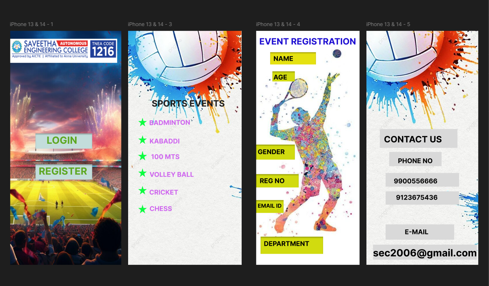
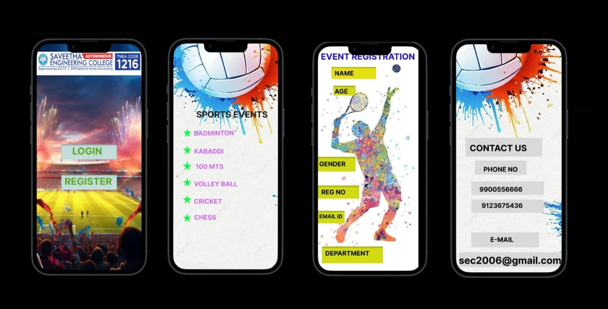

# Ex09 Event Registration Web Application
# 212224040232
## Date:21/05/2025

## AIM:
To design, develop and deploy a web application for event registration.

## DESIGN STEPS:

### Step 1:
Create a new frame.

### Step 2:
Select any one preset size of your choice.

### Step 3:
Select the shapes you need.

### Step 4:
Import images as needed.

### Step 5:
Create pages based on your need and link them.

### Step 6:

Validate the HTML and CSS code.

### Step 6:

Publish the website in the given URL.

## DESIGN TOOL:
Figma

## CODE:
home page 
```
<style>.container--0- {
  position: absolute;
  left: -415px;
  top: -444px;
  width: 405px;
  height: 856px;
  background-color: #ce65ee;
  justify-content: start;
  align-items: start;
}
.text-0-1-3 {
  width: 183px;
  height: 53px;
  color: #5da721;
  font-size: 36px;
  font-family: Inter, "Bold";
  font-weight: 700;
  text-align: left;
  vertical-align: top;
}
.text-0-1-5 {
  width: 183px;
  height: 53px;
  color: #5da721;
  font-size: 36px;
  font-family: Inter, "Bold";
  font-weight: 700;
  text-align: left;
  vertical-align: top;
}</style>
<div class="container--0-">
  <svg
    width="207"
    height="56"
    viewBox="0 0 207 56"
    fill="none"
    xmlns="http://www.w3.org/2000/svg"
  >
    <g filter="url(#filter0_i_1_4)">
      <rect width="207" height="56" fill="#C3DDDB"></rect>
    </g>
    <defs>
      <filter
        id="filter0_i_1_4"
        x="0"
        y="0"
        width="207"
        height="60"
        filterUnits="userSpaceOnUse"
        color-interpolation-filters="sRGB"
      >
        <feFlood flood-opacity="0" result="BackgroundImageFix"></feFlood>
        <feBlend
          mode="normal"
          in="SourceGraphic"
          in2="BackgroundImageFix"
          result="shape"
        ></feBlend>
        <feColorMatrix
          in="SourceAlpha"
          type="matrix"
          values="0 0 0 0 0 0 0 0 0 0 0 0 0 0 0 0 0 0 127 0"
          result="hardAlpha"
        ></feColorMatrix>
        <feOffset dy="4"></feOffset>
        <feGaussianBlur stdDeviation="2"></feGaussianBlur>
        <feComposite
          in2="hardAlpha"
          operator="arithmetic"
          k2="-1"
          k3="1"
        ></feComposite>
        <feColorMatrix
          type="matrix"
          values="0 0 0 0 0 0 0 0 0 0 0 0 0 0 0 0 0 0 0.25 0"
        ></feColorMatrix>
        <feBlend
          mode="normal"
          in2="shape"
          result="effect1_innerShadow_1_4"
        ></feBlend>
      </filter>
    </defs>
  </svg>
  <div class="text-0-1-3">LOGIN</div>
  <svg
    width="207"
    height="56"
    viewBox="0 0 207 56"
    fill="none"
    xmlns="http://www.w3.org/2000/svg"
  >
    <g filter="url(#filter0_i_2_10)">
      <rect width="207" height="56" fill="#C3DDDB"></rect>
    </g>
    <defs>
      <filter
        id="filter0_i_2_10"
        x="0"
        y="0"
        width="207"
        height="60"
        filterUnits="userSpaceOnUse"
        color-interpolation-filters="sRGB"
      >
        <feFlood flood-opacity="0" result="BackgroundImageFix"></feFlood>
        <feBlend
          mode="normal"
          in="SourceGraphic"
          in2="BackgroundImageFix"
          result="shape"
        ></feBlend>
        <feColorMatrix
          in="SourceAlpha"
          type="matrix"
          values="0 0 0 0 0 0 0 0 0 0 0 0 0 0 0 0 0 0 127 0"
          result="hardAlpha"
        ></feColorMatrix>
        <feOffset dy="4"></feOffset>
        <feGaussianBlur stdDeviation="2"></feGaussianBlur>
        <feComposite
          in2="hardAlpha"
          operator="arithmetic"
          k2="-1"
          k3="1"
        ></feComposite>
        <feColorMatrix
          type="matrix"
          values="0 0 0 0 0 0 0 0 0 0 0 0 0 0 0 0 0 0 0.25 0"
        ></feColorMatrix>
        <feBlend
          mode="normal"
          in2="shape"
          result="effect1_innerShadow_2_10"
        ></feBlend>
      </filter>
    </defs>
  </svg>
  <div class="text-0-1-5">REGISTER</div>
</div>
```
sports event
```
<style>.container--0- {
  position: absolute;
  left: 15px;
  top: -444px;
  width: 414px;
  height: 856px;
  background-color: #ffffff;
  justify-content: start;
  align-items: start;
}
.text-0-1-1 {
  width: 212px;
  height: 26px;
  color: #ce65ee;
  font-size: 24px;
  font-family: Inter, "Bold";
  font-weight: 700;
  text-align: left;
  vertical-align: top;
}
.text-0-1-2 {
  width: 213px;
  height: 38px;
  color: #ce65ee;
  font-size: 24px;
  font-family: Inter, "Bold";
  font-weight: 700;
  text-align: left;
  vertical-align: top;
}
.text-0-1-6 {
  width: 185px;
  height: 28px;
  color: #ce65ee;
  font-size: 24px;
  font-family: Inter, "Bold";
  font-weight: 700;
  text-align: left;
  vertical-align: top;
}
.text-0-1-7 {
  width: 318px;
  height: 30px;
  color: #ce65ee;
  font-size: 24px;
  font-family: Inter, "Bold";
  font-weight: 700;
  text-align: left;
  vertical-align: top;
}
.text-0-1-8 {
  width: 172px;
  height: 32px;
  color: #ce65ee;
  font-size: 24px;
  font-family: Inter, "Bold";
  font-weight: 700;
  text-align: left;
  vertical-align: top;
}
.text-0-1-9 {
  width: 310px;
  height: 37px;
  color: #ce65ee;
  font-size: 24px;
  font-family: Inter, "Bold";
  font-weight: 700;
  text-align: left;
  vertical-align: top;
}
.text-0-1-10 {
  width: 270px;
  height: 40px;
  color: #1e1e1e;
  font-size: 32px;
  font-family: Inter, "Bold";
  font-weight: 700;
  text-align: left;
  vertical-align: top;
}</style>
<div class="container--0-">
  
  <div class="text-0-1-1">CHESS</div>
  <div class="text-0-1-2">CRICKET<br /></div>
  <svg
    width="33"
    height="32"
    viewBox="0 0 33 32"
    fill="none"
    xmlns="http://www.w3.org/2000/svg"
  >
    <path
      d="M16.5 0L20.2045 12.0922L32.1924 12.0922L22.494 19.5656L26.1985 31.6578L16.5 24.1844L6.80154 31.6578L10.506 19.5656L0.807568 12.0922L12.7955 12.0922L16.5 0Z"
      fill="#0DFD41"
    ></path></svg
  ><svg
    width="33"
    height="32"
    viewBox="0 0 33 32"
    fill="none"
    xmlns="http://www.w3.org/2000/svg"
  >
    <path
      d="M16.5 0L20.2045 12.0922L32.1924 12.0922L22.494 19.5656L26.1985 31.6578L16.5 24.1844L6.80154 31.6578L10.506 19.5656L0.807568 12.0922L12.7955 12.0922L16.5 0Z"
      fill="#0DFD41"
    ></path></svg
  ><svg
    width="33"
    height="32"
    viewBox="0 0 33 32"
    fill="none"
    xmlns="http://www.w3.org/2000/svg"
  >
    <path
      d="M16.5 0L20.2045 12.0922L32.1924 12.0922L22.494 19.5656L26.1985 31.6578L16.5 24.1844L6.80154 31.6578L10.506 19.5656L0.807568 12.0922L12.7955 12.0922L16.5 0Z"
      fill="#0DFD41"
    ></path>
  </svg>
  <div class="text-0-1-6">100 MTS</div>
  <div class="text-0-1-7">BADMINTON</div>
  <div class="text-0-1-8">KABADDI</div>
  <div class="text-0-1-9">VOLLEY BALL</div>
  <div class="text-0-1-10">SPORTS EVENTS</div>
  <svg
    width="33"
    height="35"
    viewBox="0 0 33 35"
    fill="none"
    xmlns="http://www.w3.org/2000/svg"
  >
    <path
      d="M16.5 -8.62934e-06L20.3951 14.7669H33L22.8024 22.4952L26.6976 35L16.5 27.2716L6.30244 35L10.1976 22.4952L0 14.7669H12.6049L16.5 -8.62934e-06Z"
      fill="#0DFD41"
    ></path></svg
  ><svg
    width="33"
    height="32"
    viewBox="0 0 33 32"
    fill="none"
    xmlns="http://www.w3.org/2000/svg"
  >
    <path
      d="M16.5 0L20.2045 12.0922L32.1924 12.0922L22.494 19.5656L26.1985 31.6578L16.5 24.1844L6.80154 31.6578L10.506 19.5656L0.807568 12.0922L12.7955 12.0922L16.5 0Z"
      fill="#0DFD41"
    ></path></svg
  ><svg
    width="33"
    height="32"
    viewBox="0 0 33 32"
    fill="none"
    xmlns="http://www.w3.org/2000/svg"
  >
    <path
      d="M16.5 0L20.2045 12.0922L32.1924 12.0922L22.494 19.5656L26.1985 31.6578L16.5 24.1844L6.80154 31.6578L10.506 19.5656L0.807568 12.0922L12.7955 12.0922L16.5 0Z"
      fill="#0DFD41"
    ></path>
  </svg>
</div>
```
event registreation
```
<style>.container--0- {
  position: absolute;
  left: 482px;
  top: -444px;
  width: 377px;
  height: 856px;
  background-color: #d1db0f;
  justify-content: start;
  align-items: start;
}
.text-0-1-1 {
  width: 373px;
  height: 77px;
  color: #1e0ed2;
  font-size: 32px;
  font-family: Inter, "Bold";
  font-weight: 700;
  text-align: left;
  vertical-align: top;
}
.text-0-1-3 {
  width: 155px;
  height: 26px;
  color: #000000;
  font-size: 24px;
  font-family: Inter, "Bold";
  font-weight: 700;
  text-align: left;
  vertical-align: top;
}
.text-0-1-5 {
  width: 72px;
  height: 41px;
  color: #000000;
  font-size: 24px;
  font-family: Inter, "Bold";
  font-weight: 700;
  text-align: left;
  vertical-align: top;
}
.text-0-1-7 {
  width: 155px;
  height: 43px;
  color: #000000;
  font-size: 24px;
  font-family: Inter, "Bold";
  font-weight: 700;
  text-align: left;
  vertical-align: top;
}
.text-0-1-9 {
  width: 166px;
  height: 39px;
  color: #000000;
  font-size: 24px;
  font-family: Inter, "Bold";
  font-weight: 700;
  text-align: left;
  vertical-align: top;
}
.text-0-1-11 {
  width: 96px;
  height: 42px;
  color: #000000;
  font-family: Inter, "Bold";
  font-weight: 700;
  text-align: left;
  vertical-align: top;
}
.text-0-1-13 {
  width: 201px;
  height: 52px;
  color: #000000;
  font-size: 24px;
  font-family: Inter, "Bold";
  font-weight: 700;
  text-align: left;
  vertical-align: top;
}</style>
<div class="container--0-">
  
  <div class="text-0-1-1">EVENT REGISTRATION<br /></div>
  <svg
    width="167"
    height="45"
    viewBox="0 0 167 45"
    fill="none"
    xmlns="http://www.w3.org/2000/svg"
  >
    <g filter="url(#filter0_i_14_40)">
      <rect width="167" height="45" fill="#E5E111"></rect>
    </g>
    <defs>
      <filter
        id="filter0_i_14_40"
        x="0"
        y="0"
        width="167"
        height="49"
        filterUnits="userSpaceOnUse"
        color-interpolation-filters="sRGB"
      >
        <feFlood flood-opacity="0" result="BackgroundImageFix"></feFlood>
        <feBlend
          mode="normal"
          in="SourceGraphic"
          in2="BackgroundImageFix"
          result="shape"
        ></feBlend>
        <feColorMatrix
          in="SourceAlpha"
          type="matrix"
          values="0 0 0 0 0 0 0 0 0 0 0 0 0 0 0 0 0 0 127 0"
          result="hardAlpha"
        ></feColorMatrix>
        <feOffset dy="4"></feOffset>
        <feGaussianBlur stdDeviation="2"></feGaussianBlur>
        <feComposite
          in2="hardAlpha"
          operator="arithmetic"
          k2="-1"
          k3="1"
        ></feComposite>
        <feColorMatrix
          type="matrix"
          values="0 0 0 0 0 0 0 0 0 0 0 0 0 0 0 0 0 0 0.25 0"
        ></feColorMatrix>
        <feBlend
          mode="normal"
          in2="shape"
          result="effect1_innerShadow_14_40"
        ></feBlend>
      </filter>
    </defs>
  </svg>
  <div class="text-0-1-3">NAME</div>
  <svg
    width="82"
    height="37"
    viewBox="0 0 82 37"
    fill="none"
    xmlns="http://www.w3.org/2000/svg"
  >
    <g filter="url(#filter0_i_14_42)">
      <rect width="82" height="37" fill="#D1DB0F"></rect>
    </g>
    <defs>
      <filter
        id="filter0_i_14_42"
        x="0"
        y="0"
        width="82"
        height="41"
        filterUnits="userSpaceOnUse"
        color-interpolation-filters="sRGB"
      >
        <feFlood flood-opacity="0" result="BackgroundImageFix"></feFlood>
        <feBlend
          mode="normal"
          in="SourceGraphic"
          in2="BackgroundImageFix"
          result="shape"
        ></feBlend>
        <feColorMatrix
          in="SourceAlpha"
          type="matrix"
          values="0 0 0 0 0 0 0 0 0 0 0 0 0 0 0 0 0 0 127 0"
          result="hardAlpha"
        ></feColorMatrix>
        <feOffset dy="4"></feOffset>
        <feGaussianBlur stdDeviation="2"></feGaussianBlur>
        <feComposite
          in2="hardAlpha"
          operator="arithmetic"
          k2="-1"
          k3="1"
        ></feComposite>
        <feColorMatrix
          type="matrix"
          values="0 0 0 0 0 0 0 0 0 0 0 0 0 0 0 0 0 0 0.25 0"
        ></feColorMatrix>
        <feBlend
          mode="normal"
          in2="shape"
          result="effect1_innerShadow_14_42"
        ></feBlend>
      </filter>
    </defs>
  </svg>
  <div class="text-0-1-5">AGE</div>
  <svg
    width="141"
    height="55"
    viewBox="0 0 141 55"
    fill="none"
    xmlns="http://www.w3.org/2000/svg"
  >
    <g filter="url(#filter0_i_14_44)">
      <rect width="141" height="55" fill="#D1DB0F"></rect>
    </g>
    <defs>
      <filter
        id="filter0_i_14_44"
        x="0"
        y="0"
        width="141"
        height="59"
        filterUnits="userSpaceOnUse"
        color-interpolation-filters="sRGB"
      >
        <feFlood flood-opacity="0" result="BackgroundImageFix"></feFlood>
        <feBlend
          mode="normal"
          in="SourceGraphic"
          in2="BackgroundImageFix"
          result="shape"
        ></feBlend>
        <feColorMatrix
          in="SourceAlpha"
          type="matrix"
          values="0 0 0 0 0 0 0 0 0 0 0 0 0 0 0 0 0 0 127 0"
          result="hardAlpha"
        ></feColorMatrix>
        <feOffset dy="4"></feOffset>
        <feGaussianBlur stdDeviation="2"></feGaussianBlur>
        <feComposite
          in2="hardAlpha"
          operator="arithmetic"
          k2="-1"
          k3="1"
        ></feComposite>
        <feColorMatrix
          type="matrix"
          values="0 0 0 0 0 0 0 0 0 0 0 0 0 0 0 0 0 0 0.25 0"
        ></feColorMatrix>
        <feBlend
          mode="normal"
          in2="shape"
          result="effect1_innerShadow_14_44"
        ></feBlend>
      </filter>
    </defs>
  </svg>
  <div class="text-0-1-7">GENDER<br /></div>
  <svg
    width="155"
    height="49"
    viewBox="0 0 155 49"
    fill="none"
    xmlns="http://www.w3.org/2000/svg"
  >
    <g filter="url(#filter0_i_14_48)">
      <rect width="155" height="49" fill="#D1DB0F"></rect>
    </g>
    <defs>
      <filter
        id="filter0_i_14_48"
        x="0"
        y="0"
        width="155"
        height="53"
        filterUnits="userSpaceOnUse"
        color-interpolation-filters="sRGB"
      >
        <feFlood flood-opacity="0" result="BackgroundImageFix"></feFlood>
        <feBlend
          mode="normal"
          in="SourceGraphic"
          in2="BackgroundImageFix"
          result="shape"
        ></feBlend>
        <feColorMatrix
          in="SourceAlpha"
          type="matrix"
          values="0 0 0 0 0 0 0 0 0 0 0 0 0 0 0 0 0 0 127 0"
          result="hardAlpha"
        ></feColorMatrix>
        <feOffset dy="4"></feOffset>
        <feGaussianBlur stdDeviation="2"></feGaussianBlur>
        <feComposite
          in2="hardAlpha"
          operator="arithmetic"
          k2="-1"
          k3="1"
        ></feComposite>
        <feColorMatrix
          type="matrix"
          values="0 0 0 0 0 0 0 0 0 0 0 0 0 0 0 0 0 0 0.25 0"
        ></feColorMatrix>
        <feBlend
          mode="normal"
          in2="shape"
          result="effect1_innerShadow_14_48"
        ></feBlend>
      </filter>
    </defs>
  </svg>
  <div class="text-0-1-9">REG NO</div>
  <svg
    width="100"
    height="47"
    viewBox="0 0 100 47"
    fill="none"
    xmlns="http://www.w3.org/2000/svg"
  >
    <g filter="url(#filter0_i_14_50)">
      <rect width="100" height="47" fill="#D1DB0F"></rect>
    </g>
    <defs>
      <filter
        id="filter0_i_14_50"
        x="0"
        y="0"
        width="100"
        height="51"
        filterUnits="userSpaceOnUse"
        color-interpolation-filters="sRGB"
      >
        <feFlood flood-opacity="0" result="BackgroundImageFix"></feFlood>
        <feBlend
          mode="normal"
          in="SourceGraphic"
          in2="BackgroundImageFix"
          result="shape"
        ></feBlend>
        <feColorMatrix
          in="SourceAlpha"
          type="matrix"
          values="0 0 0 0 0 0 0 0 0 0 0 0 0 0 0 0 0 0 127 0"
          result="hardAlpha"
        ></feColorMatrix>
        <feOffset dy="4"></feOffset>
        <feGaussianBlur stdDeviation="2"></feGaussianBlur>
        <feComposite
          in2="hardAlpha"
          operator="arithmetic"
          k2="-1"
          k3="1"
        ></feComposite>
        <feColorMatrix
          type="matrix"
          values="0 0 0 0 0 0 0 0 0 0 0 0 0 0 0 0 0 0 0.25 0"
        ></feColorMatrix>
        <feBlend
          mode="normal"
          in2="shape"
          result="effect1_innerShadow_14_50"
        ></feBlend>
      </filter>
    </defs>
  </svg>
  <div class="text-0-1-11">EMAIL ID</div>
  <svg
    width="228"
    height="63"
    viewBox="0 0 228 63"
    fill="none"
    xmlns="http://www.w3.org/2000/svg"
  >
    <g filter="url(#filter0_i_14_52)">
      <rect width="228" height="63" fill="#D1DB0F"></rect>
    </g>
    <defs>
      <filter
        id="filter0_i_14_52"
        x="0"
        y="0"
        width="228"
        height="67"
        filterUnits="userSpaceOnUse"
        color-interpolation-filters="sRGB"
      >
        <feFlood flood-opacity="0" result="BackgroundImageFix"></feFlood>
        <feBlend
          mode="normal"
          in="SourceGraphic"
          in2="BackgroundImageFix"
          result="shape"
        ></feBlend>
        <feColorMatrix
          in="SourceAlpha"
          type="matrix"
          values="0 0 0 0 0 0 0 0 0 0 0 0 0 0 0 0 0 0 127 0"
          result="hardAlpha"
        ></feColorMatrix>
        <feOffset dy="4"></feOffset>
        <feGaussianBlur stdDeviation="2"></feGaussianBlur>
        <feComposite
          in2="hardAlpha"
          operator="arithmetic"
          k2="-1"
          k3="1"
        ></feComposite>
        <feColorMatrix
          type="matrix"
          values="0 0 0 0 0 0 0 0 0 0 0 0 0 0 0 0 0 0 0.25 0"
        ></feColorMatrix>
        <feBlend
          mode="normal"
          in2="shape"
          result="effect1_innerShadow_14_52"
        ></feBlend>
      </filter>
    </defs>
  </svg>
  <div class="text-0-1-13">DEPARTMENT</div>
</div>
```
contact us
```
<style>.container--0- {
  position: absolute;
  left: 884px;
  top: -444px;
  width: 408px;
  height: 856px;
  background-color: #31cf54;
  justify-content: start;
  align-items: start;
}
.text-0-1-2 {
  width: 240px;
  height: 39px;
  color: #000000;
  font-size: 32px;
  font-family: Inter, "Bold";
  font-weight: 700;
  text-align: left;
  vertical-align: top;
}
.text-0-1-4 {
  width: 242px;
  height: 35px;
  color: #000000;
  font-size: 24px;
  font-family: Inter, "Bold";
  font-weight: 700;
  text-align: left;
  vertical-align: top;
}
.text-0-1-6 {
  width: 212px;
  height: 34px;
  color: #000000;
  font-size: 24px;
  font-family: Inter, "Bold";
  font-weight: 700;
  text-align: left;
  vertical-align: top;
}
.text-0-1-8 {
  width: 159px;
  height: 8px;
  color: #000000;
  font-size: 24px;
  font-family: Inter, "Bold";
  font-weight: 700;
  text-align: left;
  vertical-align: top;
}
.text-0-1-10 {
  width: 87px;
  height: 29px;
  color: #000000;
  font-size: 24px;
  font-family: Inter, "Bold";
  font-weight: 700;
  text-align: left;
  vertical-align: top;
}
.text-0-1-12 {
  width: 379px;
  height: 55px;
  color: #000000;
  font-size: 36px;
  font-family: Inter, "Bold";
  font-weight: 700;
  text-align: left;
  vertical-align: top;
}</style>
<div class="container--0-">
  <svg
    width="283"
    height="69"
    viewBox="0 0 283 69"
    fill="none"
    xmlns="http://www.w3.org/2000/svg"
  >
    <rect width="283" height="69" fill="#D9D9D9"></rect>
  </svg>
  <div class="text-0-1-2">CONTACT US<br /></div>
  <svg
    width="268"
    height="50"
    viewBox="0 0 268 50"
    fill="none"
    xmlns="http://www.w3.org/2000/svg"
  >
    <rect width="268" height="50" fill="#D9D9D9"></rect>
  </svg>
  <div class="text-0-1-4">9900556666</div>
  <svg
    width="268"
    height="49"
    viewBox="0 0 268 49"
    fill="none"
    xmlns="http://www.w3.org/2000/svg"
  >
    <rect width="268" height="49" fill="#D9D9D9"></rect>
  </svg>
  <div class="text-0-1-6">9123675436</div>
  <svg
    width="191"
    height="52"
    viewBox="0 0 191 52"
    fill="none"
    xmlns="http://www.w3.org/2000/svg"
  >
    <rect width="191" height="52" fill="#D9D9D9"></rect>
  </svg>
  <div class="text-0-1-8">PHONE NO</div>
</div>
```

## OUTPUT:





## RESULT:
The program to design, develop and deploy a web application for event registration is completed successfully.
